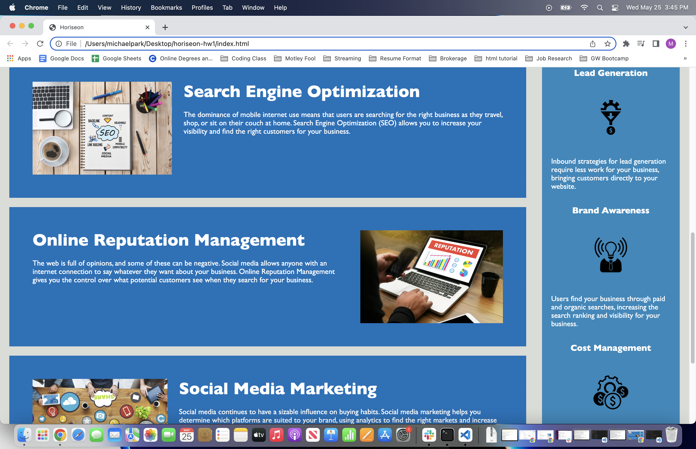

# horiseon-hw1

- changed the title to Horiseon
- added alt attributes to images
- gave an id to search engin optimization in html
- grouped duplicate codes in css
- replaced all 
s with <header>, <footer>, <main>, <aside>, <section>
- added comments
- proper indentations and spacings

deployed application: https://tjp4ca.github.io/horiseon-hw1/
github repository: https://github.com/tjp4ca/horiseon-hw1

